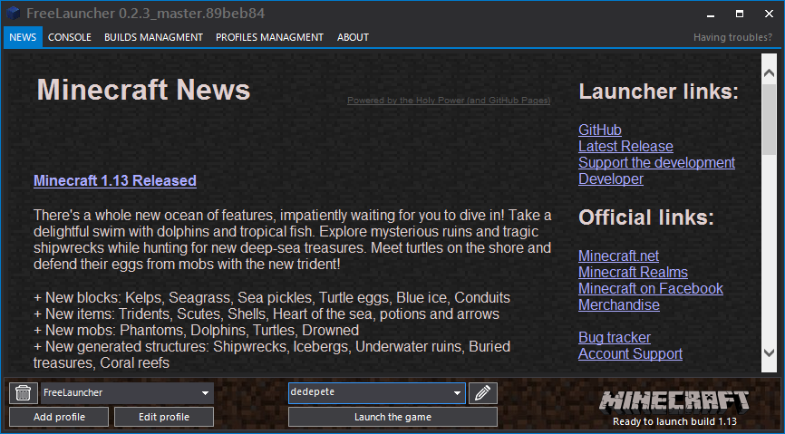

# FreeLauncher   

This is open source unofficial Minecraft launcher, based on dotMCLauncher. Feel free to contibute.

Requires **.NET Framework 4.6.1**

## Third-party assemblies used in this software
* Telerik RadControls for WinForms - http://www.telerik.com/products/winforms.aspx
* JSON.NET                         - http://james.newtonking.com/json
* DotNetZip                        - https://github.com/haf/DotNetZip.Semverd
* CommandLineParser                - https://github.com/gsscoder/commandline
